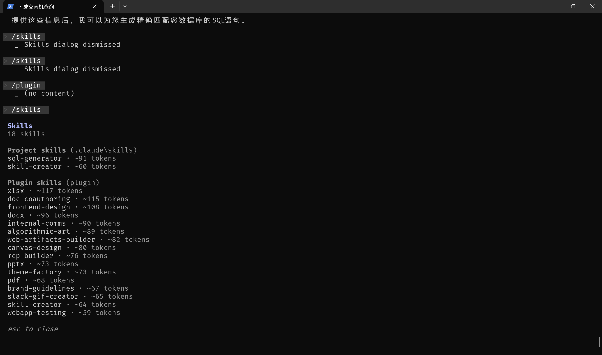
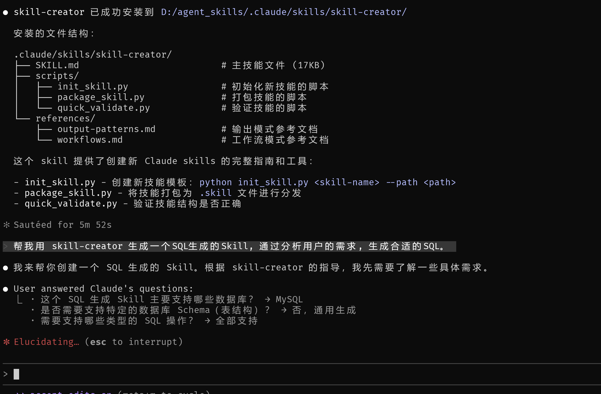
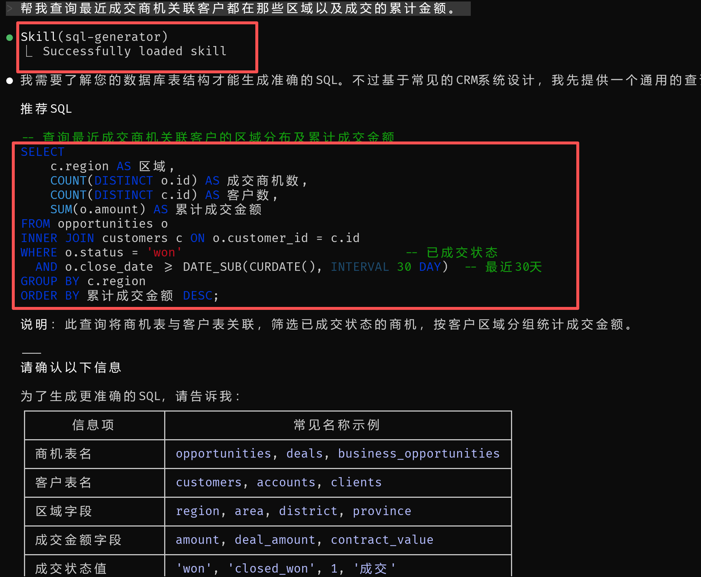
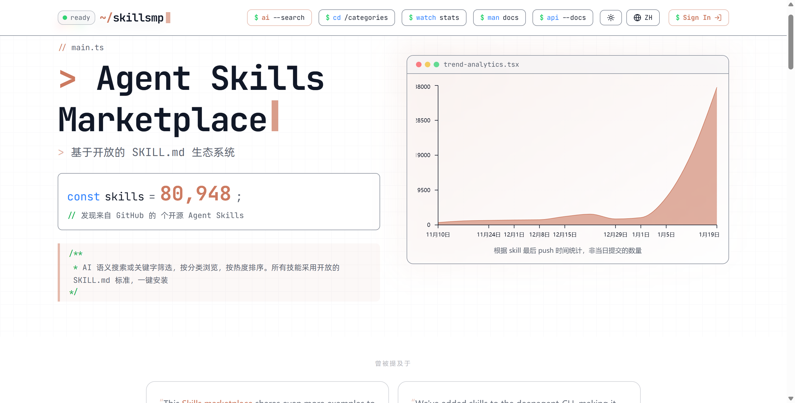

## 本文介绍如何在 Claude 中使用 Skills

### 🤔 什么是 Agent Skills
  `Agent Skills` 是扩展 `AI` 编程助手功能的模块化能力。每个 `skill` 由一个包含指令的 `SKILL.md` 文件以及可选的脚本和模板组成。 2025 年 12 月，`Anthropic` 将 `Agent Skills` 规范作为开放标准发布，`OpenAI` 也在 `Codex CLI` 和 `ChatGPT` 中采用了相同格式。`Skills` 由模型调用—— `AI` 会根据上下文自主决定何时使用它们。
  你也可以把他理解为 `超级提示词`, 它通常以下面三部分组成:
  ```yaml
  my-skill/
  ├── SKILL.md           # 主指令，精简
  ├── references/
  │   ├── REFERENCE.md   # 详细 API 文档
  │   └── EXAMPLES.md    # 使用示例
  └── scripts/
      └── helper.py      # 辅助脚本
  ```
  * **SKILL.md**: 核心指令，执行指引。
  * **references/**: 可选的参考资料，包含更详细的文档及API规范, 代码片段等。
  * **scripts/**: 可选的执行脚本，提供额外的功能支持。

  在 `Claude` 中可安装 `Skills` 市场及 `Skills` 插件, 同样也可自定义 `Skills`。可通过 `/skills` 命令查看已经安装的 Skill。
  
  如何自定义 `Skills` ?
  1. 创建一个文件夹 `.claude/skills` , 用来存放所有的 `Skills`。
  2. 按照上述的目录结构来定义一个 `Skills` (这里推荐一个用来创建 `Skills` 的 `Skills`, `skill-creator`)。
  3. 重启后生效

  如下图, 这里我使用 `skill-creator` 创建了一个自然语言生成 `SQL` 的 `Skills`。
  

### 🚀 如何使用 Agent Skills
  可以使用自然语言描述你想要完成的任务, `Claude` 会根据上下文自动调用相关的 `Skills` 来完成任务。同样也可在 `Claude` 通过 `/skill-name` 来显式调用某个 `Skills`。  
  例如, 这里我使用上面创建的 `generator_sql` 来生成一个查询某个用户订单的 `SQL` 语句。
  

这里可以参考一个 `Skills` 市场, 里面有很多现成的 `Skills` 可供使用, 链接如下 [skillsmp](https://skillsmp.com/):


### 📑 写在最后
  总的来说, `MCP` 本质上是提供大模型调用外部工具的能力, 让 `AI` 不在置身孤岛。而 `Skills` 则是通过模块化的方式, 让 `AI` 能够更好地利用这些外部工具来完成复杂任务。
  
