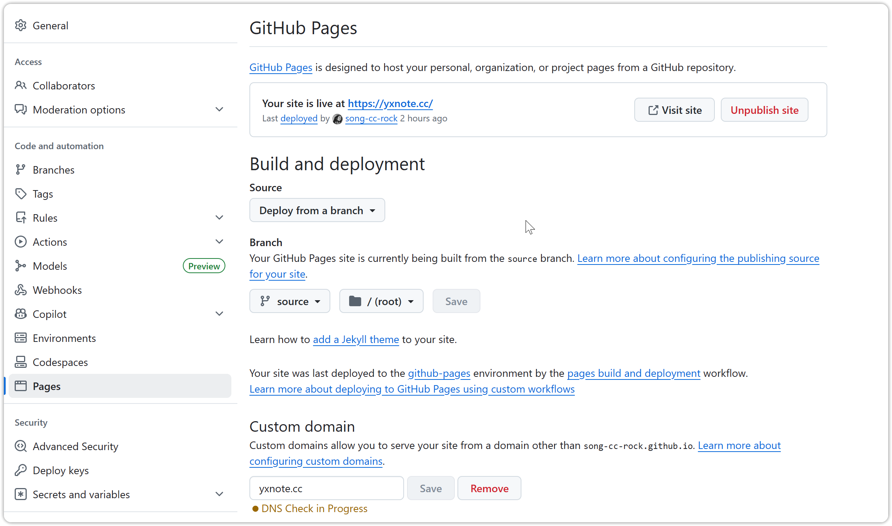

## Github Pages 部署 Hexo 博客

### 📑 搭建 Hexo 博客
```bash
npm install hexo-cli -g
hexo init blog
cd blog
npm install
hexo server
```
> 参考链接: [Hexo 官方文档](https://hexo.io/zh-cn/docs/)

### 🚀 推送到 Github 仓库并部署
 * **创建仓库<br>**
    在 Github 上创建一个新的仓库，命名为 `username.github.io`，其中 `username` 替换为你的 Github 用户名。这里我用 `master` 分支推送, 然后与远程仓库关联。

 * **添加 Github Action <br>**
    在 Hexo 博客根目录下创建 `.github/workflows/deploy.yml` 文件，内容如下：
```yaml
name: Deploy GitHub Pages

on:
  push:
    branches:
      - master
    paths-ignore:
      - ".github/**"
      - "scaffolds/**"
      - "source/_drafts/**"

permissions:
  contents: write

jobs:
  build-and-deploy:
    runs-on: ubuntu-latest
    steps:
      - name: 📦 Checkout
        uses: actions/checkout@v4
        with:
          fetch-depth: 0

      - name: 🔧 Install and Build
        run: |
          npm install
          npm run build

      - name: 🚀 Deploy
        uses: JamesIves/github-pages-deploy-action@releases/v4
        with:
          branch: source
          folder: public
          token: ${{ secrets.GITHUB_TOKEN }}
```

   简单解释一下, 这个 Github Action 会在每次推送到 `master` 分支时触发(已排除部分目录`paths-ignore`)，安装依赖，构建 Hexo 博客，并将生成的静态文件 `public`目录, 部署到 `source` 分支。<br> 
   这里使用的`github-pages-deploy`提供的插件, 如有不懂可以参考: [GitHub Actions 文档](https://docs.github.com/en/actions)。
   Github Pages 默认会从 `source` 分支提供服务。 配置如下:
   

> 到这里其实其实可以通过 `https://username.github.io/` 访问你的站点。

### 🌍 配置自定义域名(可选)
1. 在你的域名注册商处添加一个 `CNAME` 记录，指向 `username.github.io`。
2. 在 Github 仓库 `Pages` 页面, 配置 `Custom domain` 指向你的域名, 并开启 Https, 然后即可用 `https://你的域名` 访问站点。


